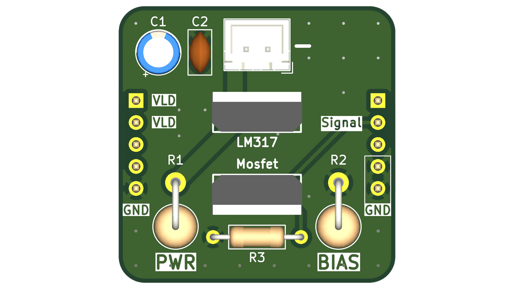

# LM317 Laser Diode Driver

A basic Laser Driver based around the LM317 voltage regulator and a MOSFET for rapid switching.

## Files

- [KiCad project archive](KiCad/Basic_Laser_Driver_KiCad.zip)
- [PCB production files (Gerbers and supporting files)](Production/LM317_driver_production_files.zip)
- [Bill of materials](BOM.csv)

## Design notes

Supply voltage: I recommend using 9 V in most applications. 12 V will also work, but the extra voltage will result in higher temperatures for the LM317.

Current capability: This design can be used with any resistor value down to 1 Ω. However, there is no room on the PCB for a heatsink, so you should not attempt to generate that much current with it. If you need more than 250 mA, I would consider using a different layout and including a heat sink.

To select the right resistor value. You can use this table for quick reference: 

- 5.1 Ω = 245mA
- 6.8 Ω = 185mA
- 10 Ω = 125mA
- 15 Ω = 85mA
- 20 Ω = 62 mA

## Testing
I recommend testing the circuit with a lower current level than the laser is rated for before increasing it to the final desired amount. If a diode is rated for 100 mA, but you only give it 50 mA, nothing bad will happen. However, the reverse will probably fry the diode permanently.
