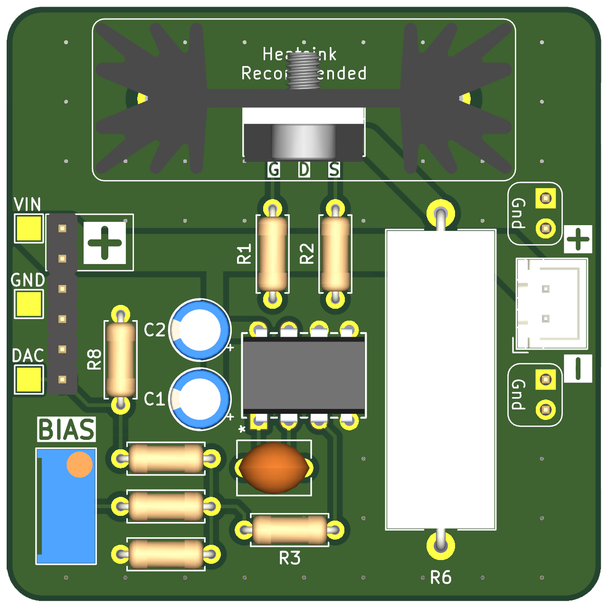

# Op-Amp + MOSFET Laser Diode Driver

Analog current regulator using an op-amp, MOSFET, and current-sense resistor.

## Design specifications
| Parameter | Value |
|---|---|
| Supply voltage | To be documented |
| Laser current range | To be documented |
| Modulation/control input | To be documented |
| Measured performance | Not documented yet |
| Validation status | Pending |

## Contents
- **KiCad/** — KiCad project, schematic, and PCB files
- **BOM.csv** — bill of materials
- **Images/** — schematic exports, PCB renders, and board photos

## Build notes
Add setup, adjustment, thermal design, wiring, and dummy-load testing instructions here.

## Safety
Verify maximum current, transient behavior and output polarity into a dummy load before attaching a laser diode. Use appropriate eye protection and safe beam containment.
