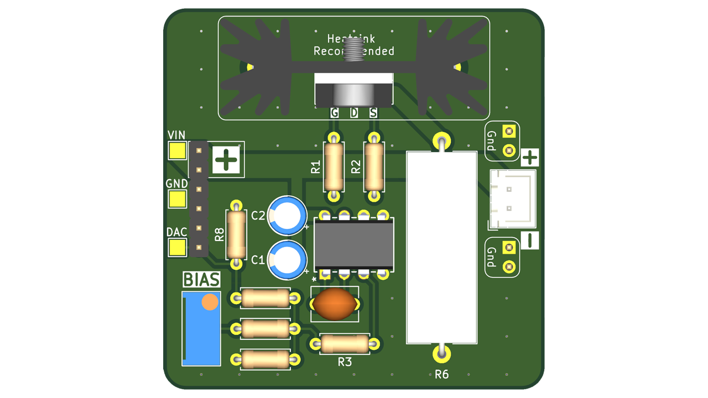

# Op-Amp + MOSFET Laser Diode Driver

Analog current regulator using an op-amp, MOSFET, and current-sense resistor.

## Design specifications
| Parameter | Value |
|---|---|
| Supply voltage | 9-12V Recommended |
| Laser current range | Based on Current-Sense Resistor value |
| Modulation/control input | DAC pin: 0-5V |
| Rise time* | Not documented yet |

## Contents
- **KiCad/** — KiCad project, schematic, and PCB files
- **BOM.csv** — bill of materials
- **Images/** — schematic exports, PCB renders, and board photos

## Build notes
- Simple single-sided two-layer PCB using all through-hole components.
- Designed around LT1215 op amp and IRF510 MOSFET. Other parts could be used, but the design would need to be adjusted.
- Two resistor footprints are provided: 2W and 5W. For lower power settings or low duty cycle, 2 W should be sufficient. For continuous high-power operation, 5 W is required. 
- Heatsink recommended. I used this: https://www.amazon.com/dp/B07B62V4FP

## Testing
Do not exceed 12V for the main supply voltage. Start with 0V on the DAC input pin and gradually increase, measuring output current with a multimeter in series with the laser diode. Laser power is directly proportional to input voltage. Remember that the total current is equal to bias current plus current set by DAC. 
