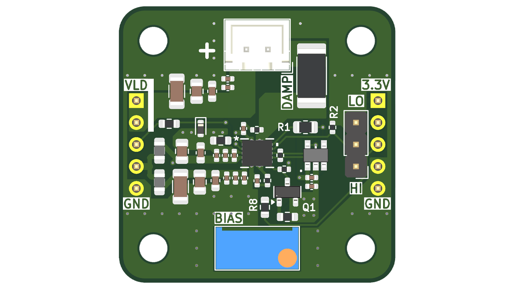

# LMH13000 Laser Diode Driver

High-Speed analog laser diode driver based on Texas Instruments LMH13000 Driver IC.

## Design specifications
| Parameter | Value |
|---|---|
| VLD Supply voltage | To be documented |
| Driver PWR voltage | 3.3-5V |
| DAC input range | 0-2V |
| Laser current range, Low Setting | Low: 5mA - 1A |
| Laser current range, High Setting* | Low: 250mA - 5A |
| Signal voltage | 3.3V |
| Rise Time | Not documented yet |

*High power setting not tested - use with caution and only in short bursts/low duty cycle.

## Contents
- **KiCad/** — KiCad project, schematic, and PCB files
- **BOM.csv** — bill of materials
- **Images/** — schematic exports, PCB renders, and board photos

## Build notes
Coming soon....

## Testing
Do not exceed 2 V on the DAC input pin. 2 V = maximum current setting. In low power mode, this is 1 A. In high power mode, this is 5 A. This board was designed to be used in low-power mode. Performance in high-power mode not guaranteed. Do not use high power mode except in very short bursts/low duty-cycle.

Modulation/switching can be controlled independently from brightness control. Signal pin high = laser on. Low = laser off. EN pin must also be driven high for the laser to be switched on.
