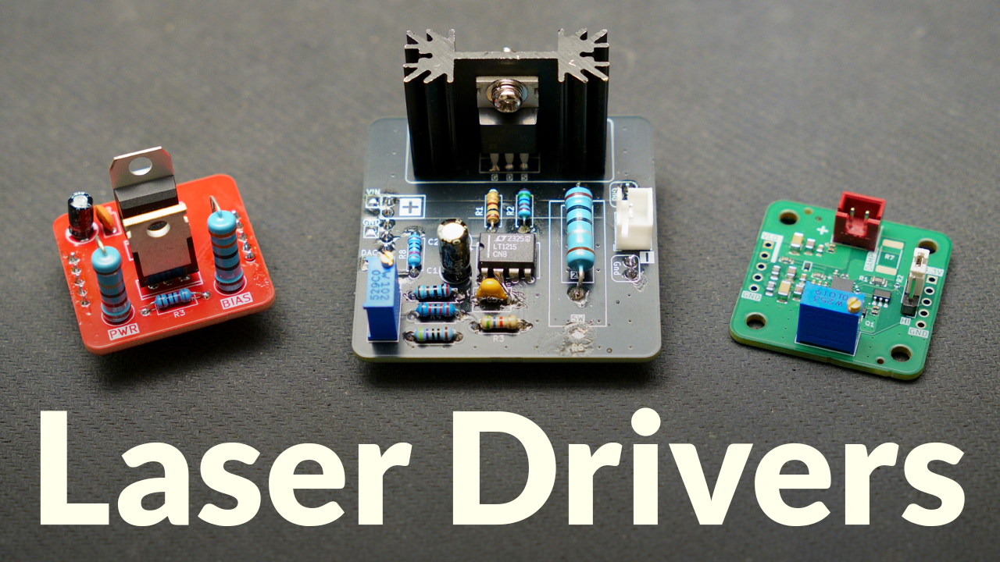

# Laser Diode Drivers

Three levels of laser driver circuits:

| Design | Description |
|---|---|
| [Beginner — LM317 Driver](01-LM317-Driver/) | Basic constant-current laser diode driver |
| [Intermediate — Op-Amp + MOSFET Driver](02-OpAmp-MOSFET-Driver/) | Adjustable analog current driver |
| [Adveanced — LMH13000 Driver](03-LMH13000-Driver/) | High-speed analog laser diode driver |

## Status
Repository under construction...

## Safety
Laser light can cause permanent eye damage and burn skin. Use wavelength and power-appropriate laser protection. Do not point lasers at people, animals, vehicles, aircraft, etc. Avoid reflective surfaces.
